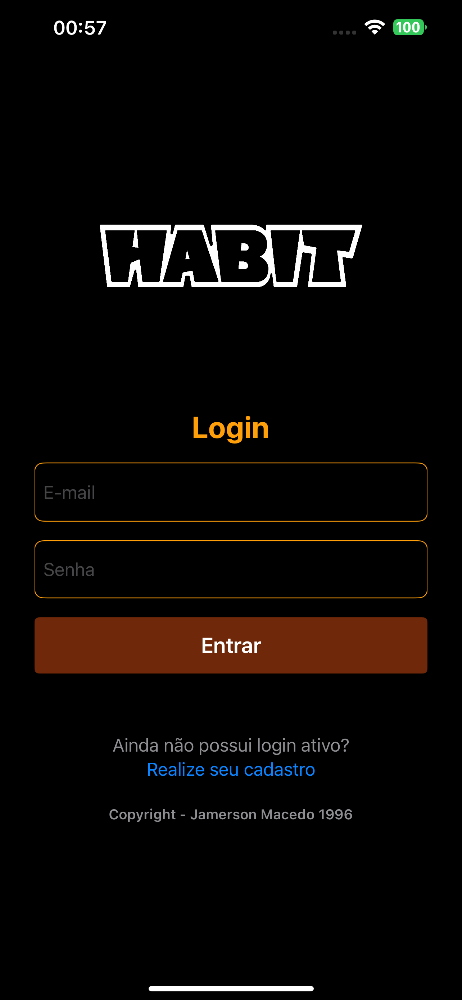

# Instagram Complete
Aplicativo do curso do thiago aguiar sobre gerenciamento de hábitos

# Funcionalidades
- Login e SingUp
- Lista de tarefas
- Graficos 
- Upload de foto pela Galeria e Camera
- Editar perfil
- Atualizar Hábito
# Tecnologias utilizadas
- Swift
- MVVM
- Tabview
- UiState
- Requisições HTTP
- Camera
- Custom View
- Combine
## Layout mobile

  
  
  
    
      

